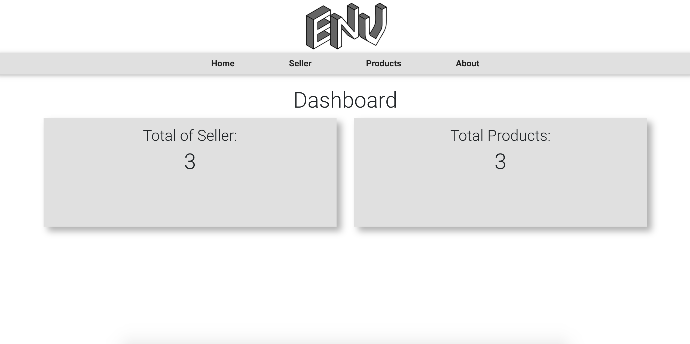
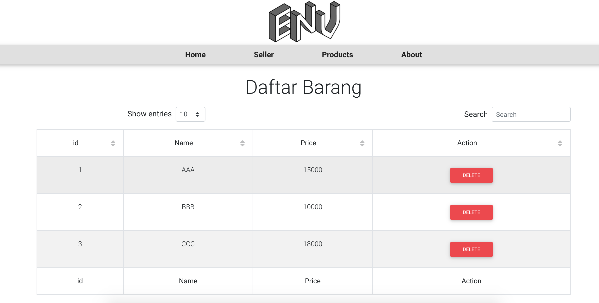

# evr_codingchallenge (Frontend)

evr_codingchallenge is basically a coding challenge project where I build the frontend of a simple single page application based on dummy data(s) to show Seller and Products that are sold on the platform. Both pages enable users to either Sort, Search function across all columns of the table, and Delete function for table's datas.

# Snapshots of Web App 
## Dashboard Page

## Products Page

## REQUIREMENTS

For development, you will need to install `Node.js` on your environment.

#### Node installation on OS X

1. Open the Terminal App and type brew install node.
2. Wait while Homebrew helps you download and install all the needed files for you to use.

After installing, you can check whether Node.js has been installed by typing `node-v` in terminal. Also to see if NPM is installed already, by typing `npm -v`

#### Node installation on Linux

On terminal, type in : 
`sudo apt-get install nodejs`

#### Node installation on Windows 

Go to [https://nodejs.org/en/download/](https://nodejs.org/en/download/) and follow all the steps to download.

## INSTALL

`$ git clone git@github.com:hendriagustino/evr_codingtest.git`  
`$ cd evr_codingtest`  
`$ npm install`

# START 

`$ npm start`
